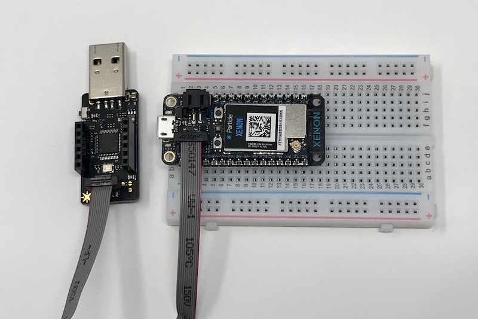
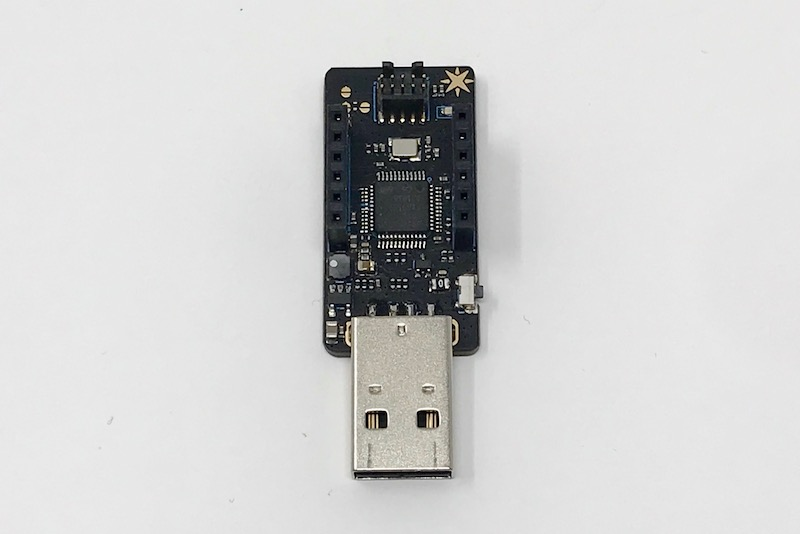

# Particle debugger

**Design files for the CMSIS-DAP debugger**

The Particle Debugger gives you the power of professional debugging at a fraction of the cost. Using this accessory, you’ll be able to program Particle mesh-ready hardware over common interfaces like JTAG and SWD, using open source tools like GDB and openocd.

Supports the open source [CMSIS-DAP specification](https://os.mbed.com/handbook/DAPLink) and DAPLink firmware developed by ARM. On Mac, Linux, and Windows it requires no additional device drivers. 

It also provides a USB to TTL serial port. This requires no device drivers on Mac, Linux, or Windows 10 or later, but you may need to [install a device driver](https://os.mbed.com/docs/v5.9/tutorials/windows-serial-driver.html) for earlier versions of Windows to use the serial port feature.

Comes with one JTAG ribbon cable.

For more information about debugging see the [JTAG FAQ](/support/particle-tools-faq/jtag/). Future version of Particle Workbench will support the Particle Debugger as well.

### Debugging mesh devices

Connecting a Argon, Boron, or Xenon to the debugger is as easy as connecting the included ribbon cable, as pictured below. It's keyed so it will only go in one way. The devices ship with a small plastic protective plug in the debugging connector; make sure you remove that first.

### Debugging legacy platforms

Using the headers on the Particle Debugger you can attach it to other ARM processor devices like the STM32 in the Particle Photon, P1, Electron, and E Series for SWD (serial wire debug).

With the debugger positioned like this, USB connector toward you and the headers facing up:

| Left Header | Right Header |
| --- | ----- |
| VDD | SWCLK |
| RTS | SWDIO |
| RX  | NC    |
| TX  | NC    |  
| CTS | GND   | 
| GND | VUSB  |

In order to use SWD debugging you need to connect:

- D7: SWDIO
- D6: SWCLK
- GND

## Firmware Update

To update the interface firmware with the latest version:

1. Download the latest interface firmware: [V0.02](./firmware/v0.02/DebuggerInterfaceV0.02.bin)
2. Press and hold the button on the Debugger.
3. Plug into an USB port of your PC.
4. It will show up a `MAINTENANCE` drive/volume.
5. Drag and drop the firmware to the drive/volume.
6. After that, it will be unmounted and remounted automatically and showing a `DAPLink` drive/volume.
7. Now, you can drag and drop any nRF52840 firmware into the `DAPLink` drive/volume to test.

